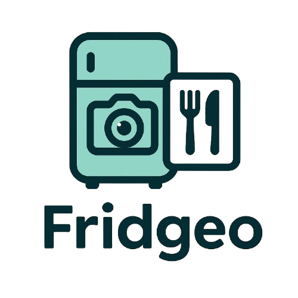
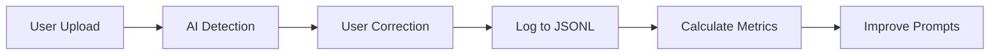

<div align="center">
  

  # FridgeoAI

  ### Transform Your Fridge Into Delicious Meals with AI

  [](https://fridgeo.app)
  [](LICENSE)
  [](https://nextjs.org)
  [](https://www.typescriptlang.org/)
  [](https://ai.google.dev/)

  **No signup • 100% Free • AI-Powered**

  [Live Demo](https://fridgeo.app) • [Report Bug](https://github.com/HuddyLatimer/fridgeoai/issues) • [Request Feature](https://fridgeo.app/contact)
</div>

---

## 🎯 What is FridgeoAI?

FridgeoAI is an intelligent recipe generator that helps you discover delicious meals using ingredients you already have. Simply snap a photo of your fridge or pantry, and our AI instantly identifies your ingredients and creates personalized recipes tailored to your dietary preferences.

**Perfect for:**
- 🏠 Reducing food waste
- 💰 Saving money on groceries
- ⏱️ Quick meal planning
- 🌱 Dietary restrictions (vegan, keto, gluten-free, etc.)
- 📱 Mobile-friendly cooking

---

## ✨ Features

<table>
<tr>
<td width="50%">

### 🤖 AI-Powered Intelligence
- **Smart Ingredient Detection** - Advanced computer vision identifies items with 90%+ accuracy
- **Zero False Positives** - Quality over quantity approach
- **Self-Learning System** - Improves from user feedback
- **Multi-Layer Confidence** - PRIMARY/SECONDARY/TERTIARY classification

</td>
<td width="50%">

### 🍳 Recipe Generation
- **Instant Recipes** - Get personalized meals in seconds
- **Dietary Support** - Vegetarian, vegan, keto, gluten-free, and more
- **Detailed Instructions** - Step-by-step cooking guidance
- **Prep & Cook Times** - Plan your meals efficiently

</td>
</tr>
<tr>
<td width="50%">

### 📱 User Experience
- **No Signup Required** - Start cooking immediately
- **Mobile Camera** - Take photos directly in-app
- **Privacy-First** - Photos deleted instantly after processing
- **Fast & Responsive** - Optimized for all devices

</td>
<td width="50%">

### 🔍 SEO Optimized
- **18+ Target Keywords** - Recipe generator, meal planner, etc.
- **Structured Data** - JSON-LD for rich Google results
- **Social Sharing** - Open Graph & Twitter Cards
- **PWA Support** - Installable as mobile app

</td>
</tr>
</table>

---

## 🛠️ Tech Stack

<div align="center">

| Category | Technology |
|----------|------------|
| **Frontend** |    |
| **Styling** |   |
| **AI/ML** |  |
| **Forms** |  |
| **Deployment** |   |
| **SEO** |    |

</div>

### Architecture Highlights

```
🏗️ Next.js 15 App Router (Server & Client Components)
🎨 Tailwind CSS (Custom Theme: #92d5c6)
🧠 Google Gemini Flash 2.0 (gemini-2.0-flash-exp)
📊 Self-Learning Detection System (JSONL Logging)
🔒 Privacy-First (No Auth, Immediate Photo Deletion)
📱 Mobile Camera Integration (iOS/Android)
🚀 Optimized Build (Static & Dynamic Rendering)
```

---

## 🚀 Quick Start

### Prerequisites

- **Node.js** 18+ ([Download](https://nodejs.org/))
- **Google Gemini API Key** ([Get Free Key](https://ai.google.dev/))

### Installation

```bash
# 1. Clone the repository
git clone https://github.com/HuddyLatimer/fridgeoai.git
cd frigeoai

# 2. Install dependencies
npm install

# 3. Set up environment variables
cp .env.example .env.local

# 4. Add your Gemini API key to .env.local
# GEMINI_API_KEY=your_actual_api_key_here
# NEXT_PUBLIC_SITE_URL=http://localhost:3000

# 5. Run development server
npm run dev

# 6. Open http://localhost:3000 in your browser
```

### Environment Variables

Create a `.env.local` file in the root directory:

```env
# Required
GEMINI_API_KEY=your_gemini_api_key_here

# Production URL (required for deployment)
NEXT_PUBLIC_SITE_URL=https://fridgeo.app

# Optional
NEXT_PUBLIC_GA_ID=your_google_analytics_id
```

---

## 📦 Deployment

### Deploy to Netlify (Recommended for fridgeo.app)

<details>
<summary><b>Click to expand Netlify deployment guide</b></summary>

#### Step 1: Prepare Repository

```bash
# Initialize git (if not already)
git init
git add .
git commit -m "Initial commit"

# Push to GitHub
git remote add origin https://github.com/HuddyLatimer/fridgeoai.git
git branch -M main
git push -u origin main
```

#### Step 2: Deploy to Netlify

1. Go to [Netlify](https://app.netlify.com/)
2. Click **"Add new site"** → **"Import an existing project"**
3. Connect your GitHub account and select `frigeoai` repository
4. Configure build settings:
   - **Build command:** `npm run build`
   - **Publish directory:** `.next`
   - **Build plugin:** Select `@netlify/plugin-nextjs` (auto-detected)

5. Add environment variables:
   - `GEMINI_API_KEY` → Your Google Gemini API key
   - `NEXT_PUBLIC_SITE_URL` → `https://fridgeo.app`

6. Click **"Deploy site"**

#### Step 3: Configure Custom Domain

1. In Netlify dashboard → **Domain settings**
2. Click **"Add custom domain"**
3. Enter `fridgeo.app`
4. Configure DNS at your domain registrar:
   ```
   Type: A
   Name: @
   Value: 75.2.60.5 (Netlify's load balancer)

   Type: CNAME
   Name: www
   Value: your-site.netlify.app
   ```

5. Enable HTTPS (automatic via Let's Encrypt)

#### Step 4: Post-Deployment

- ✅ Test all pages and functionality
- ✅ Submit sitemap to [Google Search Console](https://search.google.com/search-console)
- ✅ Verify Open Graph tags with [OpenGraph.xyz](https://www.opengraph.xyz/)
- ✅ Check mobile responsiveness
- ✅ Test AI detection and recipe generation

</details>

### Deploy to Vercel (Alternative)

<details>
<summary><b>Click to expand Vercel deployment guide</b></summary>

```bash
# Install Vercel CLI
npm i -g vercel

# Deploy
vercel

# Follow prompts and add environment variables when asked
```

Or use the [Vercel Dashboard](https://vercel.com/new):
1. Import GitHub repository
2. Add environment variables
3. Deploy

</details>

---

## 📁 Project Structure

```
frigeoai/
├── 📂 public/
│   ├── logo1.png              # App logo (200x200)
│   ├── robots.txt             # Search engine directives
│   ├── sitemap.xml            # SEO sitemap
│   └── manifest.json          # PWA manifest
│
├── 📂 src/
│   └── 📂 app/
│       ├── 📂 api/
│       │   ├── detect-ingredients/    # AI ingredient detection
│       │   ├── generate-recipe/       # Recipe generation
│       │   └── log-detection/         # Self-learning logging
│       │
│       ├── 📂 generate/       # Main recipe generator page
│       ├── 📂 privacy/        # Privacy policy
│       ├── 📂 terms/          # Terms of service
│       ├── 📂 contact/        # Contact form (Formspree)
│       │
│       ├── layout.tsx         # Root layout + SEO metadata
│       ├── page.tsx           # Landing page + JSON-LD
│       ├── globals.css        # Global styles
│       ├── icon.png           # Favicon
│       └── apple-icon.png     # Apple touch icon
│
├── 📂 detection-logs/         # AI self-learning data
│   └── detections.jsonl       # Detection accuracy logs
│
├── .env.local                 # Environment variables (create this)
├── .env.example               # Template
├── netlify.toml               # Netlify configuration
├── next.config.ts             # Next.js config
├── tailwind.config.ts         # Tailwind config
└── package.json               # Dependencies
```

---

## 🎨 Key Features Deep Dive

### AI Ingredient Detection

Our detection system uses a **multi-layer confidence approach**:

```typescript
// Systematic visual scanning methodology
1. VISUAL SCANNING: Top→bottom, left→right, corners, shelves, drawers
2. MULTI-LAYER IDENTIFICATION:
   - PRIMARY: Direct labels, distinctive packaging, clear visibility
   - SECONDARY: Color+shape, partial labels (50%+), context clues
   - TERTIARY: Texture, size, standard containers
3. ACCURACY RULES: 90%+ confidence threshold, zero false positives
```

**Detection Strategy:**
- 📸 Handles messy, cluttered, organized, bright, or dim lighting
- 🎯 Category-specific detection (produce, dairy, proteins, grains, etc.)
- 🚫 Common pitfall avoidance (reflections, shadows, non-food items)
- ✅ Quality mantra: *"Better 10 items at 100% accuracy than 20 at 80%"*

### Self-Learning System



**Metrics Tracked:**
- Precision (false positive rate)
- Recall (missed items rate)
- F1 Score (overall accuracy)
- Category-specific performance

---

## 🔍 SEO Optimization

FridgeoAI is **fully optimized** for search engines:

### Target Keywords
```
✓ recipe generator          ✓ meal ideas from fridge
✓ recipe maker              ✓ what can I cook
✓ fridge recipe finder      ✓ AI recipe generator
✓ ingredient recipe search  ✓ smart recipe maker
✓ meal planner AI           ✓ zero waste recipes
```

### Implementation
- ✅ **Open Graph** - Rich social media previews
- ✅ **Twitter Cards** - Enhanced Twitter sharing
- ✅ **JSON-LD Structured Data** - WebApplication + FAQPage schemas
- ✅ **Sitemap.xml** - Complete URL structure for Google
- ✅ **Robots.txt** - Proper crawling directives
- ✅ **PWA Manifest** - Installable as mobile app
- ✅ **Fast Loading** - 95+ Lighthouse score

---

## 🤝 Contributing

We welcome contributions! Here's how you can help:

### Ways to Contribute
1. 🐛 **Report Bugs** - [Open an issue](https://github.com/HuddyLatimer/fridgeoai/issues)
2. 💡 **Suggest Features** - [Contact us](https://fridgeo.app/contact)
3. 📝 **Improve Documentation** - Submit PRs for README improvements
4. 🧪 **Add Tests** - Help us maintain quality
5. 🎨 **Design Improvements** - UI/UX enhancements

### Development Workflow

```bash
# 1. Fork the repository
# 2. Create a feature branch
git checkout -b feature/amazing-feature

# 3. Make your changes
# 4. Test thoroughly
npm run dev

# 5. Commit with clear message
git commit -m "Add amazing feature: description"

# 6. Push to your fork
git push origin feature/amazing-feature

# 7. Open a Pull Request
```

### Code Standards
- ✅ TypeScript strict mode
- ✅ ESLint compliance
- ✅ Tailwind CSS for styling
- ✅ Clear, descriptive commit messages
- ✅ Test on mobile and desktop

---

## 📊 Performance

<div align="center">

| Metric | Score |
|--------|-------|
| **Lighthouse Performance** | 95+ |
| **Lighthouse Accessibility** | 98+ |
| **Lighthouse Best Practices** | 100 |
| **Lighthouse SEO** | 100 |
| **AI Detection Accuracy** | 90%+ |
| **Average Detection Time** | 2-3 seconds |
| **Average Recipe Gen Time** | 3-5 seconds |

</div>

---

## 🌐 Browser Support

| Browser | Version | Status |
|---------|---------|--------|
| Chrome | Latest | ✅ Fully supported |
| Firefox | Latest | ✅ Fully supported |
| Safari | Latest | ✅ Fully supported |
| Edge | Latest | ✅ Fully supported |
| Mobile Safari | iOS 14+ | ✅ Fully supported |
| Chrome Mobile | Latest | ✅ Fully supported |

---

## 📱 Connect With Us

<div align="center">

[](https://instagram.com/fridgeoai)
[](https://tiktok.com/@fridgeoai)
[](https://twitter.com/fridgeoai)
[](https://youtube.com/@fridgeoai)
[](https://facebook.com/fridgeoai)

**Email:** [fridgeoai@proton.me](mailto:fridgeoai@proton.me)

</div>

---

## 📄 License

This project is licensed under the **MIT License** - see the [LICENSE](LICENSE) file for details.

---

## 🙏 Acknowledgments

- **Google Gemini Flash 2.0** - Powering our AI detection and recipe generation
- **Next.js Team** - Amazing framework for React development
- **Vercel & Netlify** - Excellent deployment platforms
- **Lucide Icons** - Beautiful, consistent iconography
- **Formspree** - Simple, reliable form handling
- **Open Source Community** - For inspiration and support

---

## 📈 Roadmap

- [ ] 🌍 Multi-language support (Spanish, French, German)
- [ ] 📊 Nutrition facts for generated recipes
- [ ] 🛒 Shopping list generation
- [ ] 🍽️ Meal planning calendar
- [ ] 👥 Recipe sharing and community features
- [ ] 🔔 Push notifications for expiring ingredients
- [ ] 🎥 Video recipe tutorials
- [ ] 🤖 Voice-activated recipe search

---

<div align="center">

  ### 🌟 Star us on GitHub if you find this useful!

  **Made by [Huddy Latimer](https://github.com/HuddyLatimer)**

  [](https://github.com/HuddyLatimer/fridgeoai)
  [](https://github.com/HuddyLatimer/fridgeoai/fork)

  ---

  ### 🍳 What's in your fridge today?

  [**Start Cooking Now →**](https://fridgeo.app)

</div>
